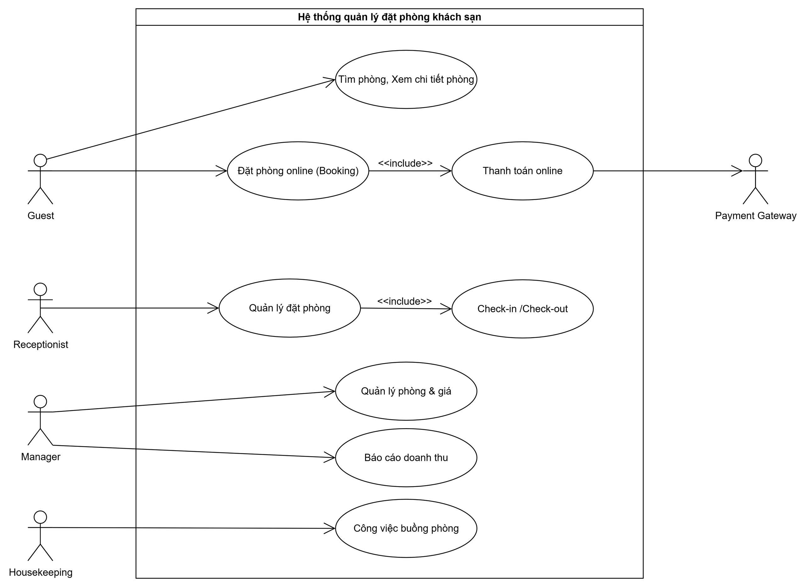
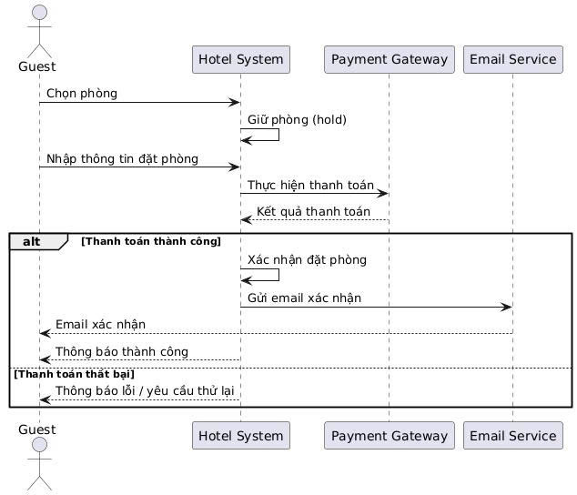
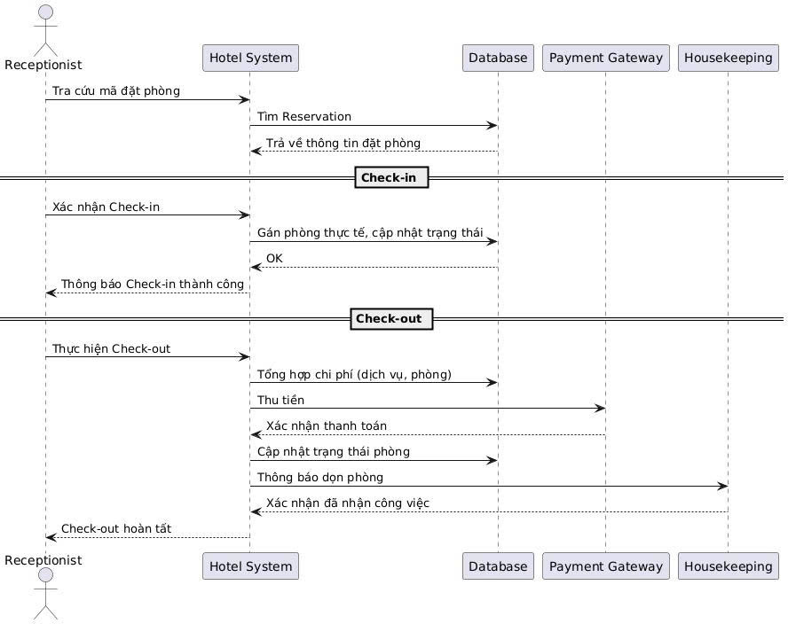
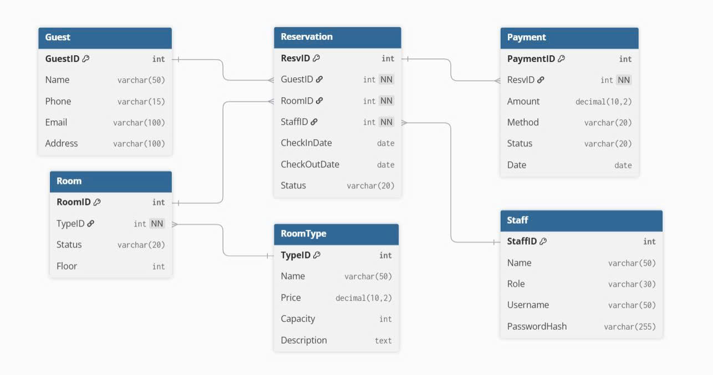

# 🏨 Hotel Booking System – Lab 2

## 📖 Giới thiệu
Đây là dự án **Hotel Booking System** được phát triển trong **Lab 2 – Nhập môn Công nghệ Phần mềm**.  
Hệ thống mô phỏng quy trình đặt phòng khách sạn, từ khâu tìm phòng, đặt phòng online, thanh toán, check-in/check-out cho đến quản lý phòng và buồng phòng.

---

## ⚙️ Chức năng chính
- **Guest (Khách hàng)**: tìm phòng, xem chi tiết phòng, đặt phòng online, thanh toán online.  
- **Receptionist (Lễ tân)**: quản lý đặt phòng, thực hiện check-in/check-out.  
- **Manager (Quản lý)**: quản lý phòng và giá, xem báo cáo doanh thu.  
- **Housekeeping (Buồng phòng)**: nhận công việc dọn phòng sau khi khách check-out.  
- **Payment Gateway**: xử lý thanh toán trực tuyến.

---

## 🖼️ Các sơ đồ UML & ERD

### 1. Use Case Diagram

### 2. Sequence Diagram – Đặt phòng

### 3. Sequence Diagram – Check-in/Check-out

### 4. ERD (Entity Relationship Diagram)

---

## 🚀 Công cụ sử dụng
- Jira: Quản lý Product Backlog, Sprint Planning, Board.
- Dbdiagram: Thiết kế ERD.
- PlantUML / Draw.io: Vẽ sơ đồ UML.
- GitHub: Lưu trữ và quản lý version của các artefact.

## 👨‍💻 Thông tin
- Môn học: **Nhập môn Công nghệ Phần mềm**
- Bài tập: Lab 2
- Thực hiện: Nguyễn Minh Khánh
- Trường: Học viện Công nghệ Bưu chính Viễn thông